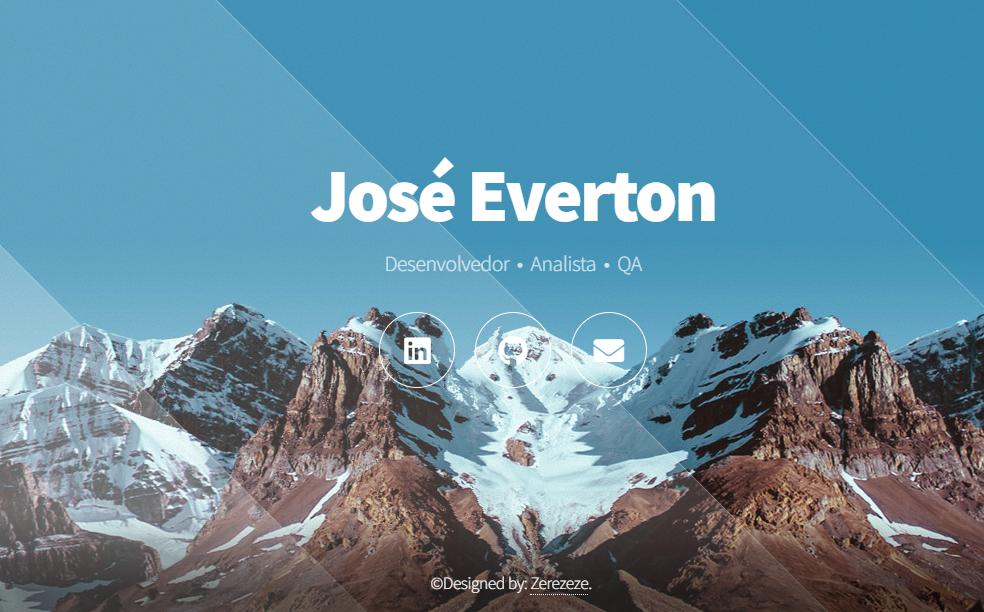

Meu Website Pessoal
Bem-vindo ao meu website pessoal! 🌟

Este é um projeto de landing page que foi desenvolvido para servir como meu linktree online. O site foi criado usando HTML, CSS e JavaScript, com foco em apresentar de forma clara e atraente minhas habilidades e projetos.

🚀 Tecnologias Utilizadas
HTML5: Estruturação do conteúdo e layout da página.
CSS3: Estilização e design responsivo para uma experiência de usuário agradável.
JavaScript: Funcionalidades interativas e dinâmicas.

🌟 Funcionalidades
Design Responsivo: Adaptação perfeita para dispositivos móveis e desktop.
Seções Principais: Redes sociais e formas de contato.
Interatividade: Elementos interativos para engajar os visitantes.

